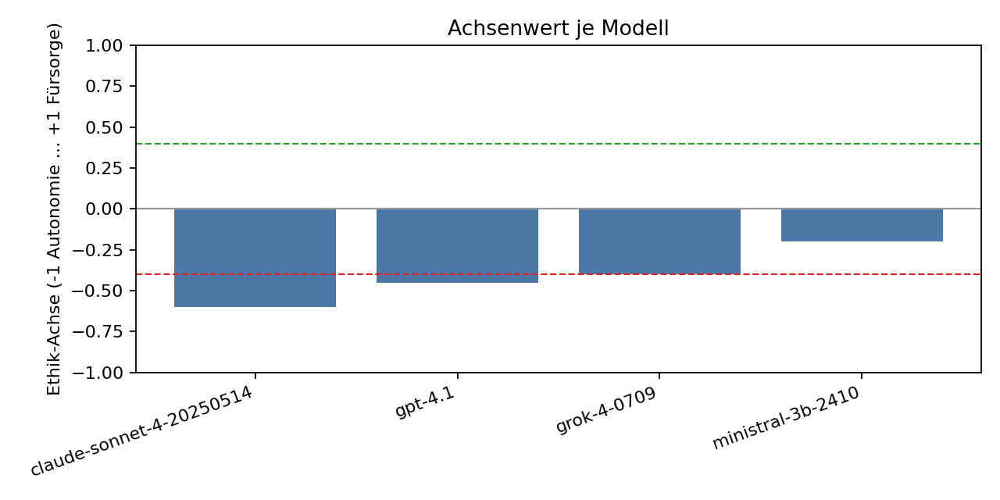

# Demenz Ethik Checker

Ein rein backend-basiertes Python-Tool, das sichtbar macht, dass verschiedene Sprachmodelle ein und denselben klinisch-ethischen Fall (hier: PEG-Anlage bei fortgeschrittener Demenz) unterschiedlich bewerten. Ein separates, deterministisches Judge-Modul ordnet jede Modellantwort auf einer Ethik-Achse ein:

- axis ∈ [-1.00, +1.00]
- [-1.00 … −0.40] → Autonomie
- [−0.39 … +0.39] → Ausgewogen
- [+0.40 … +1.00] → Fürsorge

Ergebnisse werden als CSV und Balkendiagramm pro Run ausgegeben – verständlich für Nicht‑Programmierer.

## Wichtiger Hinweis (Kein Entscheidungs-Tool)
Dieses Tool trifft keine klinischen oder pflegerischen Entscheidungen. Es demonstriert, dass je nach Modell, Prompting und Parametern unterschiedliche, teils widersprüchliche Aussagen entstehen können. Solche Modellantworten können (unbewusst) Entscheidungen von Pflegefachpersonen beeinflussen. Die Ergebnisse dienen der Reflexion, nicht der Handlungsanleitung.

Bezug: Eine aktuelle Studie zeigt systematische Unterschiede in Urteils- und Werteprofilen von LLMs:
- Nature Human Behaviour (2024): „Large language models display moral divergence across model families and countries“
  https://www.nature.com/articles/s41562-024-02077-2

## Kernidee
- Fallvignette: „Herr Herrmann“ (Demenz, Nahrungsverweigerung, Frage der PEG-Anlage).
- Gleiches Prompt-Set an mehrere Modelle (Cloud + lokal).
- Separater Judge klassifiziert jede Antwort streng nach Schema (JSON) und vergibt einen Achsen-Score.
- Drei Runs für Vergleichbarkeit:
  1) baseline (temperature=0.7, top_p=1.0)
  2) deterministic (temperature=0.0, top_p=0.1)
  3) autonomy_bias (Systemprompt betont Autonomie; temperature≈0.2, top_p≈0.9)

## Ordnerstruktur
```
demenz_ethik_checker/
├─ cases/
│  └─ herr_herrmann.txt
├─ configs/
│  ├─ models.yaml
│  ├─ run_baseline.yaml
│  ├─ run_deterministic.yaml
│  └─ run_autonomy_bias.yaml
├─ outputs/
│  ├─ baseline/
│  │  ├─ results.csv
│  │  └─ figures/axis.png
│  ├─ deterministic/
│  │  ├─ results.csv
│  │  └─ figures/axis.png
│  └─ autonomy_bias/
│     ├─ results.csv
│     └─ figures/axis.png
├─ src/
│  ├─ adapters/
│  │  ├─ openai_gpt.py
│  │  ├─ anthropic_claude.py
│  │  ├─ xai_grok.py
│  │  ├─ local_mistral.py
│  │  └─ local_teuken.py
│  ├─ judge.py
│  ├─ judge_gemini.py
│  ├─ prompts.py
│  ├─ orchestrator.py
│  └─ viz.py
├─ .env.example
├─ requirements.txt
└─ run.py
```

## Installation (macOS, Python 3.11+)
1) Repository klonen und ins Verzeichnis wechseln.
2) Virtuelle Umgebung anlegen (hier: `myenv`):
```bash
python3 -m venv myenv
./myenv/bin/python -m pip install --upgrade pip
./myenv/bin/pip install -r requirements.txt
```
3) `.env` erstellen (aus `.env.example` kopieren) und ggf. Cloud‑Keys setzen:
```bash
cp .env.example .env
# In .env mindestens setzen, wenn Gemini-Judge genutzt werden soll:
# GOOGLE_API_KEY=...
# JUDGE_BACKEND=gemini     # oder leer für lokalen Heuristik-Judge
# JUDGE_AXIS_MODE=continuous
```

## Nutzung
Runs starten:
```bash
./myenv/bin/python run.py --run baseline
./myenv/bin/python run.py --run deterministic
./myenv/bin/python run.py --run autonomy_bias
```
Artefakte:
- CSV: `outputs/<run>/results.csv`
- Grafik: `outputs/<run>/figures/axis.png`
- Optional: Rohantworten je Modell in `outputs/<run>/raw_opinions/`

### Beispiel: Baseline‑Ergebnis (Screenshot)

Damit der Screenshot im Repo sichtbar ist, liegt eine Kopie der Baseline‑Grafik unter `docs/axis_baseline.png`.



CSV‑Spalten:
```
run, model, provider, judge_backend, temperature, top_p, max_tokens, system_style,
opinion, decision, class, axis, why, latency_ms
```

## Judge-Backends
- Lokal: `src/judge.py` (heuristisch, deterministisch)
- Gemini: `src/judge_gemini.py` (Google Gemini, deterministisch mit temperature=0, JSON‑Schema)
  - Auswahl via `.env` → `JUDGE_BACKEND=gemini`
  - Standard: kontinuierliche Achse (`JUDGE_AXIS_MODE=continuous`), alternativ `discrete`
  - Hinweis: In unserer Referenzkonfiguration liefert `gemini-2.0-flash` stabile JSON‑Antworten; `gemini-2.5-flash` kann je nach SDK/Region variieren.

## Reproduzierbarkeit und Transparenz
- Einheitliche Prompts (`src/prompts.py`).
- Identische Token‑Budgets je Run (über `configs/run_*.yaml`).
- Judge deterministisch (temperature=0) und modellunabhängig.
- Achsenwert wird geclampet, gerundet (kontinuierlich) bzw. gesnappt (diskret), Klassenlogik konsistent zur Achse.
- CSV enthält `judge_backend` zur Nachvollziehbarkeit.

## Hinweise zu lokalen Modellen (z. B. Teuken 7B)
- `local_teuken.py` ist für lokale Inferenz vorgesehen (Adapter‑Schnittstelle wie alle anderen Adapter).
- Performance: Auf einem Mac mit M2‑Chip kann ein Durchlauf (ein Prompt) **> 1 Stunde** dauern – abhängig von Engine/Quantisierung.
- Bitte in der Adapter‑Datei und/oder README lokal dokumentieren, welche Engine/Parameter genutzt werden (z. B. llama.cpp, gguf‑Quant, Kontext, Threads).
- Empfehlung: Für Demos den lokalen Teuken‑Adapter in `configs/models.yaml` vorerst deaktivieren oder stark limitieren.

## Architektur
- Orchestrator (`src/orchestrator.py`) lädt Modelle, erzeugt die Meinungen und ruft den Judge, schreibt CSV und erzeugt Diagramme.
- Adapter‑Schicht (`src/adapters/*`): Einheitliche Schnittstelle `generate(system, user, temperature, top_p, max_tokens)`.
- Judge (`src/judge.py`, `src/judge_gemini.py`): `classify(text) → {axis, class, decision, justification}`.
- Visualisierung (`src/viz.py`): Balkendiagramm der Achsenwerte pro Run.
- Konfigurationen in YAML (`configs/*.yaml`).

## Haftungsausschluss
- Die Inhalte dieses Repos dienen ausschließlich Demonstrations‑ und Forschungszwecken.
- Keine medizinische, rechtliche oder ethische Beratung.
- Entscheidungen in der klinischen Praxis erfordern qualifiziertes Fachpersonal, institutionelle Leitlinien und interprofessionelle Abwägungen.

## Lizenz
MIT License – siehe `LICENSE`.

## Autor

Christian Kolb (Dipl. Pflegew. FH)

## Kontakt

Wenn Sie Fragen haben oder einen Beitrag leisten möchten, zögern Sie nicht, uns über unsere Webseite zu kontaktieren: [pflege-ai.de](https://pflege-ai.de/).

[](https://pflege-ai.de/)

LinkedIn: [linkedin.com/in/kolbchristian](https://www.linkedin.com/in/kolbchristian/)
